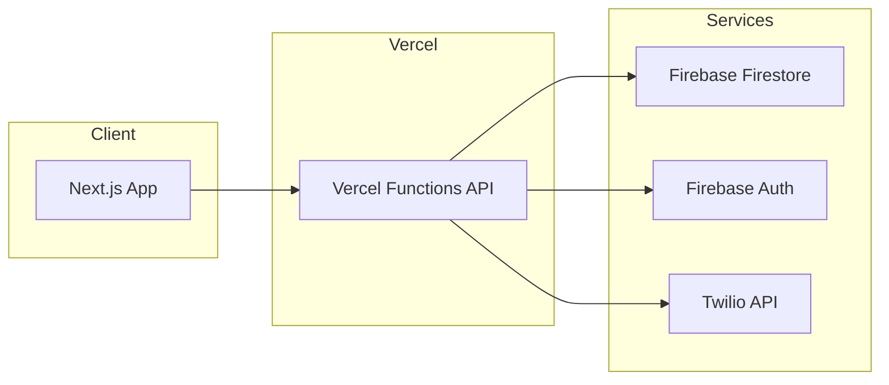

# Tech Stack & Architecture
## Dana Committee Management System (DCMS)

*Prepared for Dana Committee Volunteer Operations during Shahr-e-Lillah al-Muazzam and year-round management.*

---

## 1. Stack Summary

| Layer | Technology |
|-------|------------|
| **Frontend** | Next.js (React), deployed on Vercel |
| **Backend** | Node.js serverless functions (Vercel Functions) |
| **Database** | Firebase Firestore (real-time NoSQL) |
| **Authentication** | Firebase Authentication (role-based access control) |
| **Messaging** | Twilio API (WhatsApp, SMS, Email) |
| **Hosting** | Vercel |

---

## 2. Frontend
- **Framework:** Next.js (React)
- **Deployment:** Vercel
- **Rationale:** SSR/SSG support, strong DX, and native fit with Vercel hosting and serverless APIs.

---

## 3. Backend
- **Runtime:** Node.js
- **Model:** Serverless (Vercel Functions)
- **API:** REST (or as defined per route); used for CRUD, messaging triggers, and report generation.

---

## 4. Database
- **Service:** Firebase Firestore
- **Type:** Real-time NoSQL document database
- **Use cases:** Members, sub-teams, templates, messages, attendance records; real-time updates where needed (e.g. dashboard).

---

## 5. Authentication
- **Service:** Firebase Authentication
- **Access control:** Role-based (RBAC): Super Admin, Team Leader; Member has no login in v1.
- **Implementation:** Custom claims or Firestore role documents to enforce permissions on API and UI.

---

## 6. Messaging Integration
- **Provider:** Twilio
- **Channels:** WhatsApp, SMS, Email
- **Configuration:** API credentials and config via environment variables; no secrets in repo.

---

## 7. Hosting & Deployment
- **Platform:** Vercel
- **Contents:** Next.js app (frontend + serverless functions)
- **Optional:** Branch/preview deployments for staging and QA.

---

## 8. Security
- **Transport:** HTTPS only
- **Secrets:** Environment variables for all API keys and credentials (e.g. `.env.local`, Vercel env vars)
- **Access:** RBAC for Super Admin and Team Leader; secure, non-guessable links for attendance surveys

---

## 9. Scalability
- **Serverless:** Vercel Functions scale with traffic (e.g. spikes during Ramadan).
- **Firestore:** Scales with load; indexes and query patterns to be defined per feature.

---

## 10. Architecture (High-Level)

